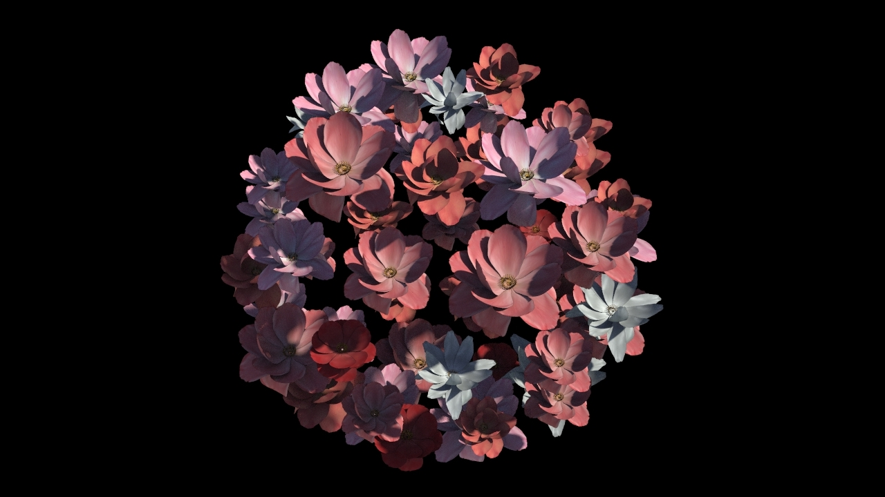
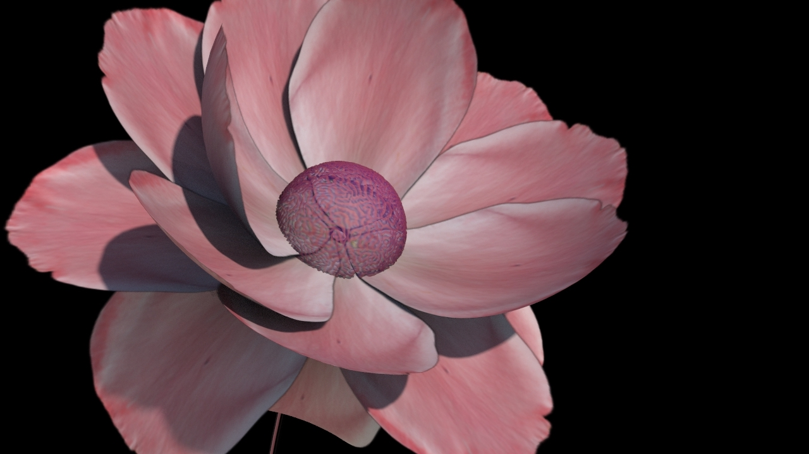
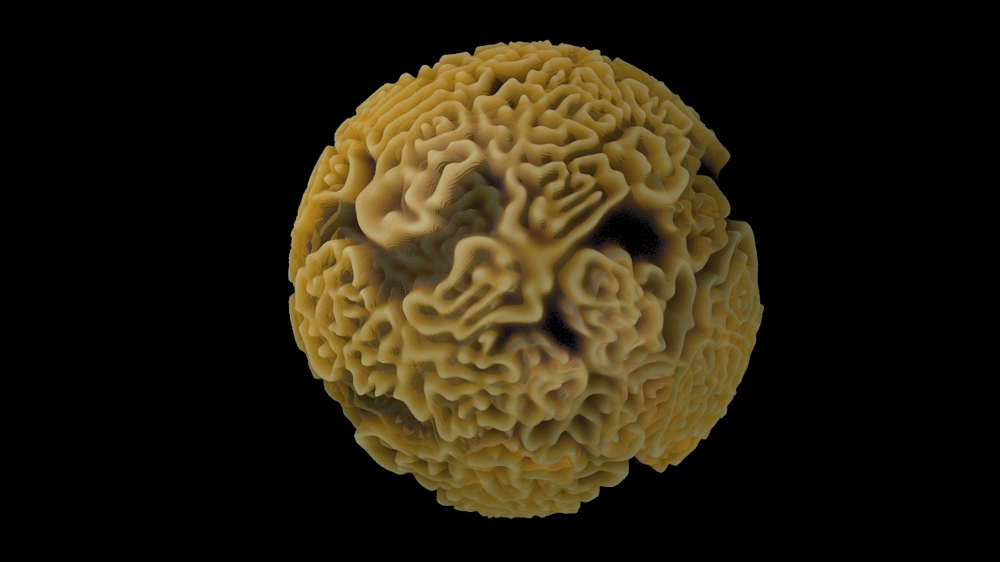

# Procedural Flower Generation

### Introduction

Modeling natural growing objects like flowers is usually a difficult task in computer graphics. Modeling a flower would usually take hours in 3d modeling software since each piece of flowers petals are unique and are not consist of simple geometric shapes. For this project, I’d like to explore ways to make this process more efficient.

### Project Objective

The objective of this project is to explore the possibility of generating flowers procedurally using Houdini. I want to create a Houdini Digital Asset that allows artists to generate flowers and be able to customize the flower to the look they want by adjusting the parameters.

### Technical Approach

It’s quite fascinating to discover how proceduralism occurs in nature. Using Houdini would take advantage of this feature, especially when turning it into an HDA that could adjust the parameters without needing to change any adjustments that happened after. Then, Lsystem is used to place flowers in a natural setting.

### Algorithm

Reaction-diffusion using the gray-scott model is an interesting and quite challenging algorithm I implemented for this project. The mathematical model was originated in chemistry, where multiple chemical substances transformed into each other and spread out over the surface. I originally want this algorithm to mimic the petal patterns found in flowers, but as I did more research, the reaction-diffusion patterns are more applicable with Orchidaceae flowers, while my project focuses on flowers that have more uniform petal distribution, like roses and lotus flowers. So I used this algorithm to generate a spherical stamen to add a more futuristic feel to one of the flower models. It’s very interesting how changing the f and k value by the slightest could cause a big difference in the results.

  

### Stylized Outputs

An interesting result I discovered for this project is that besides realistic flowers, you could also render stylized and handrawn flowers, or even non flower objects, since the generator works with any png images. Here are some renders I created, each is using the texture on its left.

### References

[CZS*13] Chen T., Zhu Z., Shamir A., Hu S.-M., Cohen-Or D.: 3-sweep: extracting editable objects from a single photo. ACM Transactions on Graphics (TOG) 32, 6 (2013), 195. 1.

[Coh67] Cohen D.: Computer simulation of biological pattern generation processes. Nature, 216 (1967), 246–248. 2.

[DL05] Deussen O., Lintermann B.: Digital Design of Nature: Computer Generated Plants and Organics. 2005. 2.

[IOOI05] Ijiri T., Owada S., Okabe M., Igarashi T.: Floral diagrams and inflorescences: interactive flower modeling using botanical structural constraints. In SIGGRAPH '05 (2005), pp. 720–726. 2.

[Olga*13] Olga Petrenko, Rubén Jesús García Hernández, Mateu Sbert, Olivier Terraz, and Djamchid Ghazanfarpour. 2013. Flower modelling using natural interface and 3Gmap L-systems. In Proceedings of the 12th ACM SIGGRAPH International Conference on Virtual-Reality Continuum and Its Applications in Industry (VRCAI '13). Association for Computing Machinery, New York, NY, USA, 101–108. DOI:https://doi.org/10.1145/2534329.2534346

[Yan*14] Yan, F., Gong, M., Cohen-Or, D., Deussen, O. and Chen, B. (2014), Flower reconstruction from a single photo. Computer Graphics Forum, 33: 439-447. https://doi.org/10.1111/cgf.12332

[Gierer*72] Gierer A, Meinhardt H. 1972. A theory of biological pattern formation. Kybernetik 12, 30-39. https://doi.org/10.1007/BF00289234

[Pearson93] J. Pearson, Complex patterns in a simple system, Science 261 (1993) 189-192. (available at arXiv.org: patt-sol/9304003)

[Munafo09] R. Munafo, Stable localized moving patterns in the 2-D Gray-Scott model (2009) 2009 draft (PDF) and figures

Tutorials:

- Abstract flower & vellum: https://www.youtube.com/watch?v=nXiSgNvxJjo
- Endless flower blossoming: https://www.youtube.com/watch?v=J2rDQtsTwzo&t=49s
- Flower + vellum: https://www.youtube.com/watch?v=jeuo5DjRsq0&t=2992s 33.51
- Flower blooming houdini + cinema4d: https://www.youtube.com/watch?v=P4y3CHo2RoA&t=213s
- Houdini l-system: https://www.youtube.com/watch?v=0vE8GiXhOWM
- Fibonacci flower: https://www.youtube.com/watch?v=nPWQpQQgWJM
- Flowers and clovers: https://www.youtube.com/watch?v=ZIWT_mwKslI
- Lsystem bloom: https://www.youtube.com/watch?v=8jYNmf1VzsQ - randomize scale
- Reaction diffusion: https://www.behance.net/gallery/124410779/Flowers-X-Particles-Reaction-Diffusion?tracking_source=search_projects%7Cdiffusion
